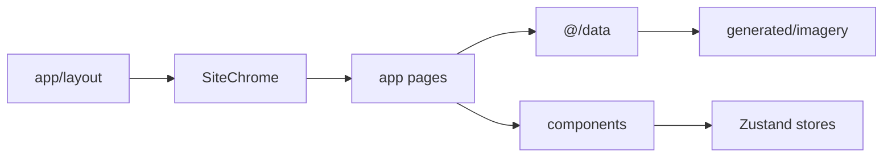

# Palmonas International

Modern demi-fine jewellery storefront prototype — Next.js App Router, TypeScript, Tailwind, Zustand.

## Quick start

```bash
npm install
npm run dev
```

Open [http://localhost:3000](http://localhost:3000).

```bash
npm run build    # production build
npm run lint     # eslint
npm run imagery  # regenerate photography URLs → src/data/generated/imagery.ts
```

## Architecture

```
src/
  app/           Routes (RSC pages) — resolve data, pass props
  components/    UI by domain (layout, commerce, editorial, product, navigation, ui)
  data/          Static catalogue — see src/data/README.md
  types/         Domain glossary (`@/types`)
  stores/        Zustand: cart, wishlist, region, ui overlays
  hooks/         useRegionalMoney, useHydrated, useScrolled
  lib/           Utilities (format, banners, art plates, motion, site)
  styles/        Design tokens + global CSS
```

**Chrome:** `app/layout.tsx` → `SiteChrome` mounts Header, Footer, Search, Cart, Wishlist, MobileNav.

**Alias:** `@/*` → `./src/*`



## Routes

| Path | Purpose |
|------|---------|
| `/` | Homepage |
| `/jewellery` | All products PLP |
| `/jewellery/[category]` | Category PLP |
| `/jewellery/[category]/[slug]` | Product detail |
| `/collections` | Collections index |
| `/collections/[slug]` | Collection detail (e.g. `ode-to-nature`, `9kt-fine-gold`) |
| `/size-guide` | Ring & bracelet size charts |
| `/policies` | Policy index |
| `/policies/[slug]` | Individual policy page |
| `/about` | About Us |
| `/contact` | Contact |
| `/stores` | Stores & services |
| `/blogs` | Blogs (stub) |

## Documentation

| Doc | Use |
|-----|-----|
| [`docs/README.md`](docs/README.md) | Docs index |
| [`docs/ARCHITECTURE.md`](docs/ARCHITECTURE.md) | How the app is structured |
| [`CHANGELOG.md`](CHANGELOG.md) | Version history (Keep a Changelog) |
| [`docs/HANDOVER-2026-08-20.md`](docs/HANDOVER-2026-08-20.md) | Developer handover for the 0.4.0 catalogue / UX batch |
| [`docs/GITHUB-RELEASE-0.4.0.md`](docs/GITHUB-RELEASE-0.4.0.md) | GitHub PR / release notes body |
| [`src/data/README.md`](src/data/README.md) | Catalogue data layer |
| [`src/components/README.md`](src/components/README.md) | UI domain folders |
| [`CONTRIBUTING.md`](CONTRIBUTING.md) | PR / contribution checklist |

## Where to edit

| Task | Location |
|------|----------|
| Catalogue (products, categories, collections) | [`src/data/`](src/data/README.md) |
| Types / domain model | [`src/types/`](src/types/index.ts) |
| Header / mega menu / footer | `src/components/layout/` + `src/data/content/navigation.ts` / `footer.ts` |
| Policy & info page copy | `src/data/content/infoPages.ts` |
| Cart / wishlist drawers | `src/components/commerce/` |
| PLP / PDP UI | `src/components/product/` |
| Homepage marketing sections | `src/components/editorial/` + `src/app/page.tsx` + `src/data/content/home.ts` |
| Design tokens | `src/styles/globals.css` |

## Client state (Zustand)

| Store | Persist key | Role |
|-------|-------------|------|
| `ui` | — | Active overlay: search / cart / wishlist / menu / filters |
| `cart` | `palmonas-cart` | Line items + gift wrap |
| `wishlist` | `palmonas-wishlist` | Product ids |
| `region` | `palmonas-region` | Market → currency display |

## Data model (short)

- Catalogue is **static** (prototype). Prices are USD; `useRegionalMoney` converts via region FX.
- Product seeds → builder assigns images from `CATEGORY_IMAGERY` and wires related products.
- Loading `@/data` enriches `category.image` and collection `productIds` / hero images.
- Prefer `import { … } from "@/data"` and `import { BANNERS, bannerFor } from "@/lib/banners"`.

Full data map: [`src/data/README.md`](src/data/README.md).
