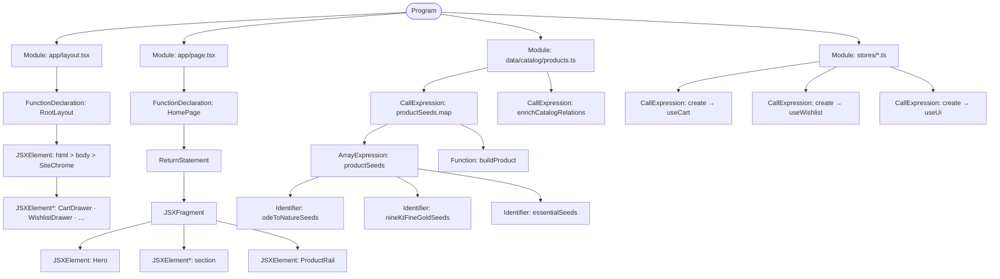

# Abstract Syntax Tree — storefront entry

Condensed AST of the main modules (TypeScript / JSX node kinds).  
Not a full-project parse — layout chrome, home page, catalogue builder, Zustand factories.

FigJam: claim from the agent-generated board linked in chat.  
Interactive canvas: `ast-diagram.canvas.tsx` in the Cursor canvases folder.
